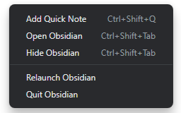

**Tray** is an [Obsidian](https://obsidian.md/) plugin that can be used to launch the app
on system startup and run it in the background, adding an icon to the system tray that it
can be minimised to and a global hotkey to toggle visibility of the app's windows.

## Configuration

| Option                     | Description                                                                                                                                                                                                                                                        | Default                                                                                         |
| -------------------------- | ------------------------------------------------------------------------------------------------------------------------------------------------------------------------------------------------------------------------------------------------------------------ | ----------------------------------------------------------------------------------------------- |
| Launch on startup          | Open Obsidian automatically whenever you log into your computer.                                                                                                                                                                                                   | Enabled                                                                                         |
| Run in background          | Hide the app and continue to run it in the background instead of quitting it when pressing the window close button or toggle focus hotkey. If both this and "Launch on startup" are enabled, windows will be hidden automatically whenever the app is initialised. | Disabled (Otherwise the window would disappear as soon as the plugin is installed and enabled.) |
| Create tray icon           | Add an icon to your system tray/menubar to bring hidden Obsidian windows back into focus on click or force a full quit/relaunch of the app through the right-click menu. _Changing this option requires a restart to take effect._                                 | Enabled                                                                                         |
| Toggle window focus hotkey | Format: [Electron accelerator](https://www.electronjs.org/docs/latest/api/accelerator)                                                                                                                                                                             | CmdOrCtrl+Shift+Tab                                                                             |

## Installation

### Obsidian Marketplace (Coming Soon)

1. In Obsidian, navigate to **Settings** → **Community plugins**.
2. Press the **Browse** button beside the **Community plugins** option.
3. Search for `Tray` in the **Filter** text input.
4. Select `Tray` and press **Install**.
5. Once the plugin has finished installing, press **Enable**.
6. Press the **Options** button.
7. Configure the plugin as you wish.
8. You're done! 🎉

### Manual

1. Download this repository.
2. Copy it into your vault's `.obsidian/plugins` directory.
3. In Obsidian, navigate to **Settings** → **Community plugins**.
4. Press **Turn on community plugins** if you haven't already.
5. Find `Tray` in the list of **Installed plugins** and toggle it on.
6. Press the **⚙️** button beside the toggle you just used.
7. Configure the plugin as you wish.
8. You're done! 🎉

## Disclaimer

This plugin is provided as-is and is designed for personal use. It has not
been tested on every platform and may not work as expected with all future updates.
If you notice something is not working as intended, please open a bug report or
pull request so it can be fixed.
